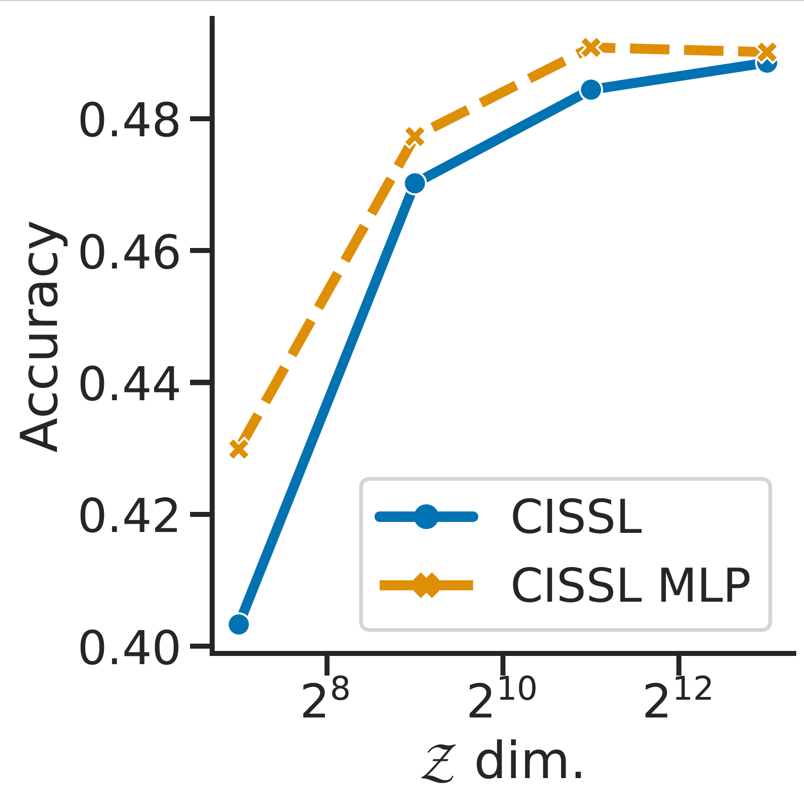
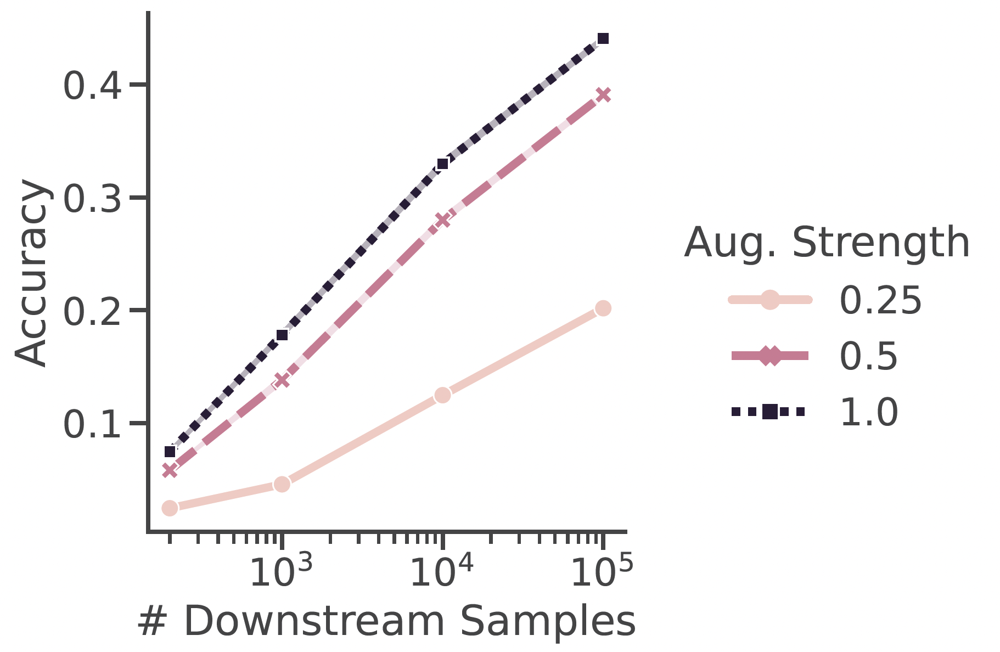

# Lossy Compression for Lossless Prediction [](https://github.com/YannDubs/lossyless/blob/main/LICENSE) [](https://www.python.org/downloads/release/python-380/)


This repostiory contains pretrained weights from and the original implementation of [Improving Self-Supervised Learning by Characterizing Idealized Representations](https://arxiv.org/abs/2209.06235),
which derives a simple uniying framework for invariant self-supervised learning (ISSL).
Our framework provides actionable insights into ISSL that lead to important empirical gains such as how to:
- [**Simplify non-contrastive ISSL using our DISSL objective**](#dissl-tinyimagenet) (no momentum encoders / no stop-gradients / ... )
- [**Choose the dimensionality of representations**](#dimensionality) 
- [**Choose the architecture of projection probes**](#projection-heads) 
- [**Choose the augmentations**](#augmentations)

The following provides the code load our ImageNet pretrained models, to reproduce our key results, and minimal notebook implementations of our DISSL [](https://colab.research.google.com/github/YannDubs/Invariant-Self-Supervised-Learning/blob/main/notebooks/minimal_dissl.ipynb) and CISSL [](https://colab.research.google.com/github/YannDubs/Invariant-Self-Supervised-Learning/blob/main/notebooks/minimal_cissl.ipynb).


## DISSL


https://user-images.githubusercontent.com/24327668/197094787-67f7e5cd-edb1-4448-aa1c-45cb65e4fe69.mp4


Our DISSL objective is a very simple non-contrastive objective that outperforms previous baselines. 

We release our pretrained weights on torch hub. 
To load any of our model use:
```python
import torch

model = torch.hub.load('YannDubs/Invariant-Self-Supervised-Learning:main', 
                       'dissl_resnet50_d8192_e800_m8')
```

Here are all available models with their respective linear probing performance on ImageNet.
They are all ResNet50 trained with a batch size of 2560 and 16fp on 8 A100.

| Epochs | Dimensionality | Multi-crop    |  ImageNet top-1 acc. | ImageNet top-5 acc. |                TorchHub name |                                                                                                                                   Weights | 
|--------|----------------|---------------|---------------------:|--------------------:|-----------------------------:|------------------------------------------------------------------------------------------------------------------------------------------:|
| 100    | 2048           | 2x224         |                 66.9 |                87.5 | dissl_resnet50_dNone_e100_m2 | [model](https://github.com/YannDubs/Invariant-Self-Supervised-Learning/releases/download/v1.0.0-alpha/dissl_resnet50_dNone_e100_m2.torch) | 
| 100    | 8192           | 2x224         |                 68.9 |                88.5 | dissl_resnet50_d8192_e100_m2 | [model](https://github.com/YannDubs/Invariant-Self-Supervised-Learning/releases/download/v1.0.0-alpha/dissl_resnet50_d8192_e100_m2.torch) |
| 100    | 8192           | 2x160 + 4x96  |                 70.7 |                88.5 | dissl_resnet50_d8192_e100_m6 | [model](https://github.com/YannDubs/Invariant-Self-Supervised-Learning/releases/download/v1.0.0-alpha/dissl_resnet50_d8192_e100_m6.torch) |
| 400    | 2048           | 2x224         |                 71.1 |                90.2 | dissl_resnet50_dNone_e400_m2 | [model](https://github.com/YannDubs/Invariant-Self-Supervised-Learning/releases/download/v1.0.0-alpha/dissl_resnet50_dNone_e400_m2.torch) | 
| 400    | 2048           | 2x160 + 4x96  |                 73.0 |                91.3 | dissl_resnet50_dNone_e400_m6 | [model](https://github.com/YannDubs/Invariant-Self-Supervised-Learning/releases/download/v1.0.0-alpha/dissl_resnet50_dNone_e400_m6.torch) |     
| 400    | 8192           | 2x160 + 4x96  |                 74.0 |                91.9 | dissl_resnet50_d8192_e400_m6 | [model](https://github.com/YannDubs/Invariant-Self-Supervised-Learning/releases/download/v1.0.0-alpha/dissl_resnet50_d8192_e400_m6.torch) |
| 800    | 8192           | 2x224 + 6x96  |                 73.9 |                91.9 | dissl_resnet50_d8192_e800_m8 | [model](https://github.com/YannDubs/Invariant-Self-Supervised-Learning/releases/download/v1.0.0-alpha/dissl_resnet50_d8192_e800_m8.torch) |

For an example of how to use the pretrained models see: [](https://colab.research.google.com/github/YannDubs/Invariant-Self-Supervised-Learning/blob/main/notebooks/torchhub.ipynb). 

We also provide a minimal DISSL implementation: [](https://colab.research.google.com/github/YannDubs/Invariant-Self-Supervised-Learning/blob/main/notebooks/minimal_dissl.ipynb)


## Reproducing main results 


To reproduce our key TinyImageNet results you need to install ISSL (see below) and run the desired script in `bin/tinyimagenet/*.sh`.
To run the script without slurm use `bin/tinyimagenet/*.sh -s none`.
If you want to use slurm then you need to define the desired configs in `config/server` for an example see `nlprun` or `vector` which can be called using `bin/tinyimagenet/*.sh -s <server_name>`.

<details>
<summary><b>Installation</b></summary>

1. Clone repository
2. Install [PyTorch](https://pytorch.org/) >=  1.9
3. `pip install -r requirements.txt`. 

If you have issues try installing out exact dependencies using `conda env update --file environment.yaml`.

</details>

For our ImageNet models we used [VISSL](www.vissl.ai). The exact commands can be seen on this (still uncleaned/undocumented) [VISSL fork](https://github.com/YannDubs/vissl) and we aim to incorporate DISSL in the main VISSL soon.


### DISSL TinyImageNet

The right column in Table 1 of our paper shows empirically that DISSL outperforms DINO on TinyImageNet.
To reproduce a similar table (single seed) run `bin/tinyimagenet/table1_distillation.sh -s none` (no servers/slurm).
Once the script is finished you can collect and print the results by running `bin/tinyimagenet/table1_distillation.sh -v "" -a is_force_gpu=False`.
You should get the following results printed:

| Model    | TinyImageNet Linear probing acc. |
|:---------|---------------------------------:|
| DINO     |                            43.3% |
| DISSL    |                            45.1% |
| + dim.   |                            48.0% |
| + epochs |                            49.0% |
 | + aug.   |                            50.7% |

Training curves: <a href="https://wandb.ai/issl/issl_opensource/groups/table1_distillation"><a/>


### Dimensionality

In our paper we characterize exactly the minimal and sufficient dimensionality depending on the probing architecture.
For linear probes it's much larger than standard dimensionalities, which suggests that one would gain important gains by increasing dimensionality. 
Figure 7c of our paper shows empirically that this is indeed the case.
To reproduce a similar figure (single seed) run `bin/tinyimagenet/fig7c_dimensions.sh -s none`.
Once the script is finished you can collect and print the results by running `bin/tinyimagenet/fig7c_dimensions.sh -v "" -a is_force_gpu=False`.
The following figure will then be saved in `results/exp_fig7c_dimensions/fig7c.pdf`.

<p float="left" align="middle">

</p>


Training curves: <a href="https://wandb.ai/issl/issl_opensource/groups/fig7c_dimensions"><a/>


### Projection heads


In our paper, we prove that one of the two projection heads needs to have the same architecture as the dowsntream probe.
This is to ensure that the SSL representations are pretrained the same way as they will be used in downstream tasks.


This is the difference between our CISSL and SimCLR. 
The left column in Table 1 of our paper shows empirically that this improves performance.
To reproduce a similar table (single seed) run `bin/tinyimagenet/table1_contrastive.sh -s none` (no servers/slurm).
Once the script is finished you can collect and print the results by running `bin/tinyimagenet/table1_contrastive.sh -v "" -a is_force_gpu=False`.
You should get the following results printed:

| Model    | TinyImageNet Linear probing acc. |
|:---------|---------------------------------:|
| SimCLR   |                            45.2% |
| CISSL    |                            45.8% |
| + dim.   |                            47.6% |
| + epochs |                            48.7% |
 | + aug.   |                            51.2% |

Training curves: <a href="https://wandb.ai/issl/issl_opensource/groups/table1_contrastive"><a/>


We also provide a minimal CISSL implementation: [](https://colab.research.google.com/github/YannDubs/Invariant-Self-Supervised-Learning/blob/main/notebooks/minimal_cissl.ipynb)


### Augmentations

In our paper we characterize exactly optimal sample efficiency as a function of how coarse the equivalence class induced by augmentations are.
In particular, our theory suggests that stronger label-preserving augmentations improve performance.
Figure 7a of our paper shows empirically that this is indeed the case.
To reproduce a similar figure (single seed) run `bin/tinyimagenet/fig7a_augmentations.sh`.
The following figure will then be saved as `results/exp_fig7a_augmentations/fig7a.pdf`.

<p float="left" align="middle">

</p>


Training curves: <a href="https://wandb.ai/issl/issl_opensource/groups/fig7a_augmentations"><a/>
